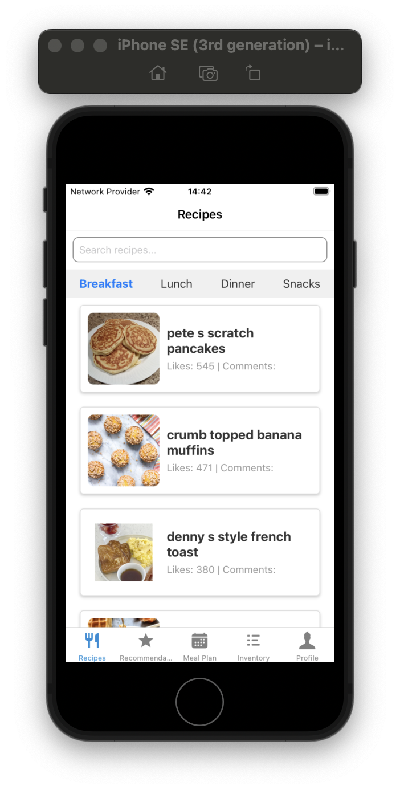
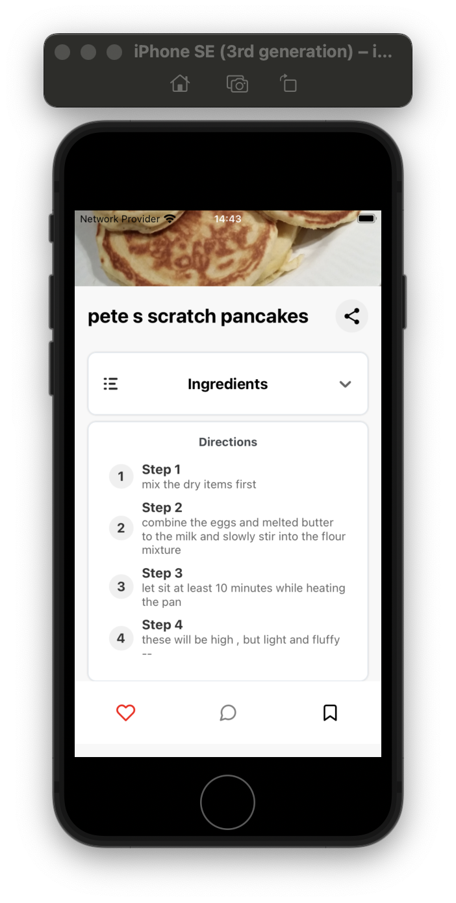

<h1 align="center">Hi 👋, I'm Xiaoha</h1>
<h3 align="center">Master's in Software Development | Building Full-Stack & Data-Driven Applications</h3>

  

---

## 🛠 Tech Stack

  
  
  
  
  
  
  
  
  
  
  
  
  

---

## 🚀 Highlight Projects

### 🅿️ Smart Parking System (iTwin Hackathon)
A real-time urban parking app leveraging **iTwin**, **Supabase**, and **iOS**.
- Displays available parking spaces using **3D viewer** and **live updates**
- Integrated **ECSQL + iModel + Supabase** for cross-platform data sync
- iOS app supports search, map, and real-time status updates
- 🥉 3rd Place – **Bentley iTwin4Good Championship 2024** (42 teams)

👉 [GitHub Repo](https://github.com/Xiaoha-cloud/parking-iTwin)

---

### 🍽️ Recipe Management System (Full-stack App)
A full-featured meal planner app with recipes, inventory, and shopping lists.
- Built with **Spring Boot + React Native**, deployed on **AWS Lambda**
- **JWT authentication**, **Redis caching**, **MySQL RDS**, and a **recommendation engine**
- Supports meal planning, weekly themes, and recipe recommendations

📱 **App Screenshots**  
| Home Page | Recipe Details |
|-----------|----------------|
|  |  |

🔗 [Frontend (React Native)](https://github.com/Simple-Recipes/frontend-React-Native/tree/dev) | [Backend (Spring Boot)](https://github.com/Simple-Recipes/backend)

---

### 🧪 BioReactLab – Metabolic Reaction Builder
A Django + React app to simulate and balance metabolic reactions.
- Features **formula validation**, **RDKit integration**, and **interactive visualization**
- Real-time molecular preview, deployed on **Netlify + Railway**
- Built for researchers and students in systems biology

🌐 [Live Demo](https://shimmering-alfajores-f7f968.netlify.app)

---

### 📈 Hotel Review Sentiment Analyzer (NLP)
A Chinese text classification project using **LSTM** and **topic modeling**.
- Used **Zhihu embeddings + BiLSTM** (Keras + TensorFlow)
- Explored semantic themes with **Gensim LDA** and **pyLDAvis**
- Achieved **87% accuracy** on a 4,000-sample dataset

---

### 🛰️ NASA API Explorer (Backend)
A lightweight backend proxy for NASA’s public APIs.
- Built with **Node.js + Express**
- Routes include APOD, ISS Tracker, and NASA image search
- Deployed on **Vercel** with **Swagger API Docs**

🔗 [GitHub Repo](https://github.com/Xiaoha-cloud/nasa-explorer-backend)

---

## 📫 Contact Me

- GitHub: [@xiaoha-cloud](https://github.com/xiaoha-cloud)
- LinkedIn: [Jiahong Lin](https://www.linkedin.com/in/jiahong-lin-8b74462b0/)
- Email: infojemi@gmail.com
